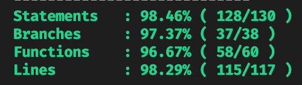

# BookmarkManager

This project was generated with [Angular CLI](https://github.com/angular/angular-cli) version 12.0.3.

## Solution

I've kept the state management simple by only creating actions, reducer, and a service that ties everything together.

`bookmark-manager.actions.ts` -- contains 3 actions: add, remove, and edit

`bookmark-manager.reducer.ts` -- all necessary state changes for the 3 actions.

`bookmarks-store.service.ts` -- uses @ngrx/store's Store to dispatch above actions and provide the `bookmarkList$` observable

I generally make sure to work with flat models for easier processing. So the model looks like:

```
export interface Bookmark {
  readonly id: string;
  readonly name: string;
  readonly url: string;
  readonly group?: BookmarkGroup;
}
```

For the components, all of them are _modularized_ (declared and exported from their own modules). I've written a few:

`bookmark-list.component` -- displays the list of bookmarks, button to add a new one, and an input-with-autocomplete field

`bookmark-card.component` -- represents a single `Bookmark` that can do several things: copy url to clipboard, edit, delete, and preview url

`bookmark-form.component` -- serves as the form component opened in a `MatDialog` that has 3 inputs: name, url, and group

`bookmark-deletion.component` -- serves as the deletion confirmation opened in a `MatDialog`

`input-chips.component` -- amalgamation of `MatInput`, `MatAutocomplete`, and `MatChips` that emits the active chips

So to summarize the flow, it goes something like:

1. Bookmarks will be managed by the store
2. `BookmarkListComponent` lists down all existing bookmarks
3. Once a user clicks on add button, it spawns a `bookmark-form.component` via `MatDialog`
4. Once a user confirms, an `AddBookmarkAction` is dispatched with the form value
5. From the list, once a user clicks on the edit button, it spawns the same `bookmark-form.component` with the existing data as `MAT_DIALOG_DATA`
6. `bookmark-form.component` gets pre-populated using the data
7. Once user confirms, an `EditBookmarkAction` is dispatched with the updated form value
8. From the list, if a user clicks on the delete button, it spawns a `bookmark-deletion.component` via `MatDialog`
9. Once user confirms, a `DeleteBookmarkAction` id dispatched with the bookmark ID
10. From the list, if a user types/selects on the `Filter by group` field, it filters only matching bookmarks

``

## Test Coverage



## How do I run it?

You don't have to! You can see it live here: https://baraluga-bookmark-manager.netlify.app/

## Okay, but I really prefer it running on my local machine!

1. clone the repository
2. npm install
3. npm run start
